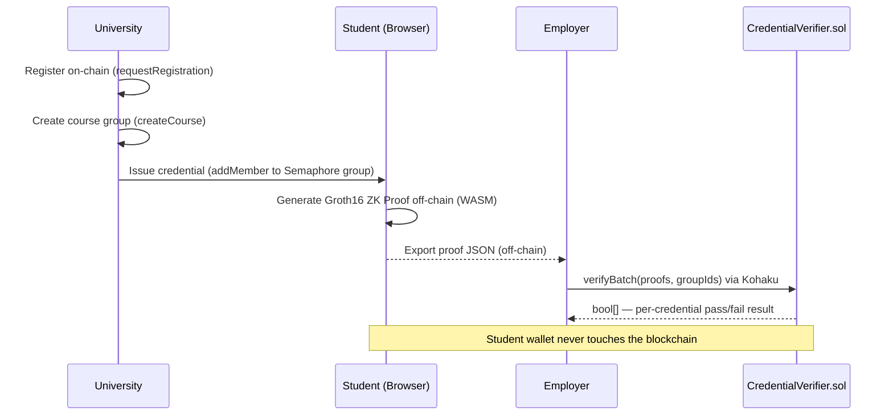

# SecureHire

[](https://nodejs.org)
[](https://pnpm.io)
[](https://docs.soliditylang.org)
[](https://nextjs.org)
[](https://sepolia.etherscan.io)
[](#license)

> IITG.eth Hackathon 2026 — Building Private Apps using Ethereum
> IIT Guwahati | August 9-10, 2026

A zero-knowledge credential verification system. Students prove they passed specific university courses to employers — without revealing their identity, wallet address, or anything else on their transcript.

**Selective disclosure. Cryptographic proof. Quantum-safe architecture.**

> **Package naming note:** The internal monorepo packages are named under `@eternity-id/*` (the project's original working title). The product is called **SecureHire**.

---

## Table of Contents

- [The Problem](#the-problem)
- [How It Works](#how-it-works)
- [Architecture](#architecture)
- [Getting Started](#getting-started)
- [Application Portals](#application-portals)
- [Kohaku Integration](#kohaku-integration)
- [Semaphore v4 Function Reference](#semaphore-v4--function-reference)
- [Engineering Challenges](#engineering-challenges)
- [Security](#security)
- [Deployed Contracts](#deployed-contracts)
- [Tech Stack](#tech-stack)
- [Project Structure](#project-structure)
- [License](#license)

---

## The Problem

Credential verification today is broken in three ways.

**1. The employer side is manual and slow.**

There is no automated way for an employer to verify a candidate's academic credentials. They contact universities manually, wait days for responses, and repeat the process for every new hire. It is expensive and does not scale.

**2. Students are forced to over-disclose.**

Applying to a job requires handing over an entire transcript, even when the employer needs to verify just one course. A student exploring opportunities while currently employed has no way to selectively share credentials without exposing their full academic record to a third-party platform.

**3. Ethereum is a public ledger.**

Submitting a credential proof from a wallet permanently links that wallet address to an identity and institution on-chain. Standard wallets also rely on ECDSA, which future quantum computers will be able to break.

---

## How It Works

SecureHire uses Semaphore v4's ZK group membership protocol to separate what an employer can verify from what they can see.

When a university issues a credential, the student's identity commitment is added to an anonymous Semaphore Merkle group on-chain. The student's actual identity never appears. When the student wants to prove a qualification, they generate a Groth16 ZK proof entirely in their browser. This proof guarantees group membership without identifying the member. The student exports it as a JSON file and hands it to the employer off-chain.

The employer uploads the file to the verification portal. The portal calls `verifyBatch()` on the `CredentialVerifier` contract, which validates the proof and records the nullifier. Each proof is usable only once per job application. The student's wallet address appears nowhere in this chain of events.

**On gas privacy.** The student never submits any blockchain transaction. The university pays gas to issue credentials. The employer pays gas to verify them. The student is fully off-chain, which means their wallet is never traceable through gas payments — without needing a relayer or Paymaster.



---

## Architecture

### Smart Contracts

**`CourseRegistry.sol`**

The single source of truth for all courses and degrees. Maps each `groupId` to a `Course` struct. An `isDegree` flag distinguishes individual course groups from degree-level aggregate groups. Only `CredentialIssuer.sol` can write to it.

**`CredentialIssuer.sol`**

Manages university authorization via OpenZeppelin `AccessControl` with a `UNIVERSITY_ROLE`. Handles the full credential lifecycle — `requestRegistration`, `approveUniversity`, `revokeUniversity`, `createCourse`, `createDegree`, `linkCourseToDegree`, and `issueCredential`. All Semaphore write operations (`createGroup`, `addMember`, `removeMember`) go through this contract, so the contract address is always the group admin, never an EOA.

**`CredentialVerifier.sol`**

Exposes `verifyCredential()` for a single proof and `verifyBatch()` for a bundle. The batch function wraps each `semaphore.validateProof()` in a try/catch so one bad proof does not revert the entire transaction. Returns `bool[]` with a per-proof result. Maintains a `usedNullifiers` mapping to reject replays.

### Identity Vault (`packages/identity-vault`)

A TypeScript package (`@eternity-id/identity-vault`) for client-side identity and proof operations.

- `createIdentity(signer)` — Signs a fixed message with MetaMask, hashes the signature with `SubtleCrypto.digest('SHA-256')`, and passes the result to `new Identity(seed)`. The same wallet always recovers the same Semaphore identity.
- `generateCredentialProof(identity, group, jobId, groupId)` — Computes scope as `BigInt('0x' + ethers.id(`${groupId}-${jobId}`).slice(2, 18))` and calls `generateProof()` from `@semaphore-protocol/proof`. The Groth16 WASM circuit runs client-side; the `.wasm` and `.zkey` artifacts are loaded at runtime from `@semaphore-protocol/proof`'s bundled assets.
- `createPQAccount(seed)` — Attempts to load `@kohaku-eth/pq-account`. Falls back to a deterministic SHA-256 mock.

---

## Getting Started

### Prerequisites

- Node.js >= 18
- pnpm >= 8
- MetaMask browser extension
- A funded Sepolia wallet (get testnet ETH from [sepoliafaucet.com](https://sepoliafaucet.com))

### Install

```bash
pnpm install
```

### Environment Setup

```bash
cp .env.example .env
```

Fill in the values:

```bash
# Root .env — used by Hardhat for contract deployment
SEPOLIA_RPC_URL=https://your-quicknode-endpoint/
PRIVATE_KEY=your_deployer_private_key
ETHERSCAN_API_KEY=          # optional, for contract verification on Etherscan

# Frontend env vars (NEXT_PUBLIC_* are exposed to the browser)
NEXT_PUBLIC_SEPOLIA_RPC_URL=https://your-quicknode-endpoint/
NEXT_PUBLIC_SEMAPHORE_ADDRESS=0x8A1fd199516489B0Fb7153EB5f075cDAC83c693D
NEXT_PUBLIC_COURSE_REGISTRY_ADDRESS=     # filled after deployment
NEXT_PUBLIC_CREDENTIAL_ISSUER_ADDRESS=   # filled after deployment
NEXT_PUBLIC_CREDENTIAL_VERIFIER_ADDRESS= # filled after deployment
```

> The `NEXT_PUBLIC_*` variables in the root `.env` are also read by the Next.js dev server. After deploying contracts, copy the output addresses into these variables. An `apps/web/.env.local` file takes precedence over the root `.env` for the web app if you prefer to keep them separate.

### Run the Frontend

```bash
pnpm dev
```

### Compile Contracts

```bash
cd packages/contracts
pnpm compile
```

### Deploy to Sepolia

```bash
cd packages/contracts
pnpm deploy:sepolia
```

After deployment, copy the printed addresses into the `NEXT_PUBLIC_*` variables in your `.env` or `apps/web/.env.local`.

### Run on a Local Hardhat Node

```bash
# Terminal 1 — start local node
cd packages/contracts
npx hardhat node

# Terminal 2 — deploy contracts to local node
cd packages/contracts
npx hardhat run scripts/deploy.ts --network localhost
```

Then set `NEXT_PUBLIC_SEPOLIA_RPC_URL=http://127.0.0.1:8545` in `apps/web/.env.local` and point the contract addresses to your local deployment.

---

## Testing

### Smart Contract Tests

```bash
cd packages/contracts

# Full test suite
pnpm test

# Security-focused audit test suite
pnpm test:audit
```

### Identity Vault Tests

```bash
cd packages/identity-vault

# Run once
pnpm test

# Watch mode
pnpm test:watch
```

---

## Application Portals

| Portal | Route | Actor | Description |
|---|---|---|---|
| Admin | `/admin` | Ministry of Education | Approve and revoke university registrations. Requires `DEFAULT_ADMIN_ROLE`. |
| University | `/university` | Institutions | Register, manage courses and degrees, issue credentials to students. |
| Student | `/student` | Students | Deterministic login, view credentials, generate single or bundle proof JSON. |
| Employer | `/verify` | Employers | Upload proof JSON, verify on-chain via Kohaku, see per-credential pass/fail result. |

---

## Kohaku Integration

SecureHire integrates two Kohaku primitives. One is fully active; the other runs as an architecture stub.

### `@kohaku-eth/provider` — Active

> **Status: Fully integrated and functional**

Used in the Employer Verification portal (`apps/web/src/app/verify/page.tsx`). Because the package is alpha-stage, standard ethers contract wrappers cannot be used. The calldata is manually encoded and submitted via `EthersSignerAdapter`.

```ts
// apps/web/src/app/verify/page.tsx
import { EthersSignerAdapter, createTx } from '@kohaku-eth/provider/ethers';

const data = contract.interface.encodeFunctionData('verifyBatch', [proofs, groupIds]);
const kohakuSigner = new EthersSignerAdapter(signer);
const tx = createTx(contractAddress, data, 0n);
await kohakuSigner.sendTransaction(tx);
```

### `@kohaku-eth/pq-account` — Architecture Stub

> **Status: Wrapper is production-ready; key generator runs on a deterministic mock**

Each student's Semaphore identity is designed to be rooted in a CRYSTALS-Dilithium post-quantum key pair instead of ECDSA. The identity vault wrapper is fully implemented and drop-in replaceable. The key generator falls back to a SHA-256 mock because `@kohaku-eth/pq-account` is not yet published to npm.

```ts
// packages/identity-vault/src/pq-account.ts
export async function createPQAccount(seed?: string) {
  try {
    // new Function() bypasses Next.js 15 static ESM analysis,
    // which cannot handle pure-ESM packages at build time.
    const getKohaku = new Function("return import('@kohaku-eth/pq-account')");
    const kohaku = await getKohaku();
    return kohaku.createPQAccount(seed);
  } catch {
    return createMockPQAccount(seed); // deterministic SHA-256 fallback
  }
}
```

---

## Semaphore v4 — Function Reference

| Function | Location | Purpose |
|---|---|---|
| `semaphore.createGroup(address(this))` | `CredentialIssuer.sol` | Creates an anonymous Merkle group for a course or degree |
| `semaphore.addMember(groupId, commitment)` | `CredentialIssuer.sol` | Adds a student's commitment to the group on credential issuance |
| `semaphore.removeMember(groupId, commitment, siblings)` | `CredentialIssuer.sol` | Revokes a credential via Merkle sibling-path removal |
| `semaphore.validateProof(groupId, proof)` | `CredentialVerifier.sol` | Validates a Groth16 proof on-chain |
| `new Identity(seed)` | `identity-vault` / Student Portal | Creates the client-side Semaphore identity from a deterministic seed |
| `generateProof(identity, group, message, scope)` | Student Portal (browser) | Runs the WASM Groth16 witness computation entirely off-chain |

---

## Engineering Challenges

**Scope truncation — identical nullifiers in batch proofs.**

Scope was computed as `Buffer.from(jobId + "-" + groupId).toString('hex').slice(0, 16)`. The job ID was exactly 8 characters, so 16 hex chars — the slice silently removed the entire `groupId`. Every proof in a bundle produced the same nullifier, causing replay reverts on-chain. Fixed by switching to `BigInt('0x' + ethers.id(`${groupId}-${jobId}`).slice(2, 18))`.

**Parallel transactions — nonce conflict on multi-course issuance.**

Firing all `issueCredential()` calls in parallel gave MetaMask multiple transactions to sign with the same nonce. All but the first failed. Fixed by chaining them sequentially with `await tx.wait()` and showing a live progress indicator to the university admin.

**Multi-proof bundle — false failures on the verify page.**

The UI only checked transaction success, not individual proof results. In a 3-course bundle, unselected courses showed as failed even when valid proofs existed for them. Fixed by iterating the `bool[]` returned by `verifyBatch()` and displaying a per-credential pass/fail row.

**MetaMask account switch not reflected in the UI.**

The `accountsChanged` event fired correctly, but `BrowserProvider.listAccounts()` returned the stale cached address. The portal showed the old account's status until a manual refresh. Fixed by reading `accounts[0]` directly from the event payload instead of re-querying the provider.

**Semaphore group admin conflict.**

Early versions called `semaphore.addMember()` directly from the university's EOA. Since the group was created with `address(this)` as admin, the EOA was not authorised and the call reverted. Fixed by routing all Semaphore write operations through `CredentialIssuer.sol` functions.

**Non-deterministic student identity.**

Identity was generated randomly on each login. Clearing the browser cache produced a different commitment, losing all issued credentials. Fixed by deriving the seed deterministically from a MetaMask-signed message hashed with `SubtleCrypto.digest('SHA-256')`.

---

## Security

| Attack | Defence |
|---|---|
| Replay | `usedNullifiers` mapping rejects any previously seen nullifier |
| Tampered proof | `semaphore.validateProof()` fails the on-chain arithmetic check on `points[]` |
| Cross-course reuse | Proof is bound to a specific Merkle root; a commitment not in Course B's tree produces an invalid proof |
| Unauthorised issuance | OpenZeppelin `AccessControl` — only `UNIVERSITY_ROLE` can call `createCourse` |
| Duplicate registration | `requestRegistration()` reverts with "Already registered" on a second call |
| Cross-university degree linking | `linkCourseToDegree()` checks the caller owns both the course and degree group |

---

## Deployed Contracts (Sepolia)

| Contract | Address |
|---|---|
| Semaphore v4 (PSE) | `0x8A1fd199516489B0Fb7153EB5f075cDAC83c693D` |
| CourseRegistry | `0x8895d0401384Dffd60E53df362D3f422e2A0bF23` |
| CredentialIssuer | `0x9499153dDf0bD0c8A6F173d0bD4cF0780183e85D` |
| CredentialVerifier | `0xAAe96283690450E6a869e2a44aAb4a04Cf453605` |

---

## Tech Stack

| Category | Technology |
|---|---|
| ZK Protocol | Semaphore v4 — Groth16 group membership proofs |
| Transaction Provider | @kohaku-eth/provider |
| Post-Quantum Identity | @kohaku-eth/pq-account (stub, SHA-256 fallback) |
| Smart Contracts | Solidity 0.8.23 + Hardhat + OpenZeppelin |
| Frontend | Next.js 15 (App Router), Vanilla CSS |
| Monorepo | pnpm workspace |
| Network | Ethereum Sepolia Testnet |

---

## Project Structure

```
apps/
  web/
    src/app/
      admin/           Ministry of Education portal
      university/      University registration and dashboard
      student/         Student portal
      verify/          Employer verification portal
    src/lib/
      hooks/
        useWallet.ts   MetaMask connection and account tracking
      contracts.ts     Contract addresses and ABIs

packages/
  contracts/
    contracts/
      CourseRegistry.sol
      CredentialIssuer.sol
      CredentialVerifier.sol
    test/
      *.test.ts        Hardhat test suite
      full-audit.test.ts
    scripts/
      deploy.ts

  identity-vault/      (@eternity-id/identity-vault)
    src/
      identity.ts      Deterministic Semaphore identity derivation
      proof.ts         ZK proof generation
      pq-account.ts    Kohaku PQ account wrapper with fallback
      index.ts
```

---

## License

MIT License — see [LICENSE](./LICENSE) for details.

---

## Team

Kushal N — BTech Mathematics and Computing, 2nd year, IIT Guwahati.
Built for the IITG.eth Hackathon 2026.
